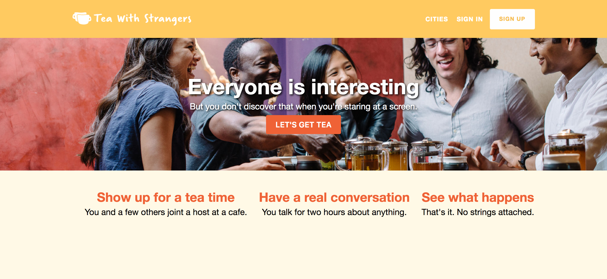
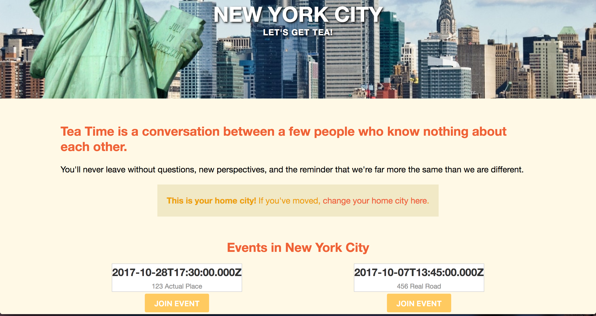

# TWSClone

[Live Demo](https://twsclone.herokuapp.com/)

TWSClone is the highly unoriginal working name of a clone of [Tea With Strangers](https://teawithstrangers.com), a social meetup app created by Ankit Shah. This project was build over the course of just under two weeks, though future improvements are planned.

A Ruby on Rails backend connects a Postgres SQL database to the React/Redux frontend. Once users create and/or sign in to an account, they will be able to specify the area in which they live and join meetups located there, which are hosted by a user and attended by a handful of other users. Users will have access to a dashboard that will display any meetups that they are joined as attendees and any meetups that they have created and will host.

---

## Features

* Secure frontend to backend user authorization utilizing BCrypt
* Index of cities where meetups are available
* City page
  * View city
  * Set city as home
  * View city events
  * Join events in home city

---

### View Cities

Mirroring the webapp upon which it is based, TWSClone is available in select cities.

Users can choose from one of six major cities, where they can join or create meetups with other users in the same region.

### View City

Each individual city includes several features

The city page allows users to set that city as the user's home, which well then let the user join events in that city. The page will notify the user if the city they are viewing is their home city, and prompt them to set the city as their home city if it is not. A user may view events in city that is not set as their home, but instead of a Join button there will be a notification that they must set that city as their home city in order to join that city's events.

---

## Technologies

### Additional Resources

* [Proposal wireframes](https://github.com/jbieze/twsclone/wiki/Wireframes)
* [Schema](https://github.com/jbieze/twsclone/wiki/Schema)
* [Component Hierarchy](https://github.com/jbieze/twsclone/wiki/Component-Hierarchy)
* [Routes](https://github.com/jbieze/twsclone/wiki/Routes)

## Features to Implement

There are several features for TWSClone still in the works, which will be completed and implemented at a future time.

### Join / Leave Event

Joining an event will alter the user's state and assign that event to it, and will also re-render the button to read "Leave Event" instead.

### Host Event

Users will be able to create events themselves, with the user being assigned as the events' host. That event will be assigned to that user's home city, and other users will be able to join that created event as attendees.

### Dashboard

Users will be able to access a personal dashboard, which will have a several features. There users will be able to view the events that they are attending, as well as the events the events that they have created and are hosting.

Users will be able to view all of the events that they have attended in the past, whether as attendee or host.

Users will be able to adit their personal account information, including email address, password, and profile picture.

### CSS (Re)Styling

The styling of the webapp will be significantly revised as the project goes along; as it nears completion, a complete overhaul is anticipated.
